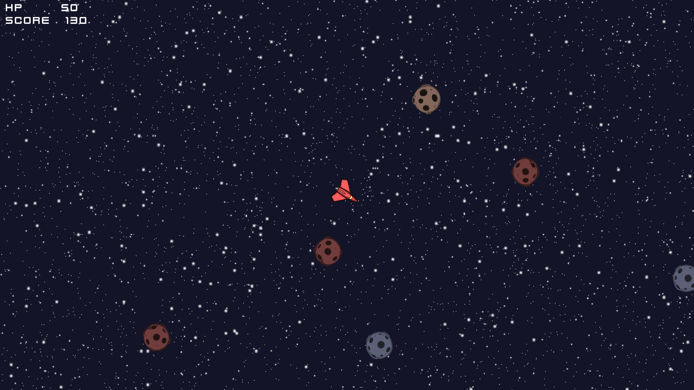

# Top Down Space Shooter
First game (attempt) in c++. The code is one hell of a mess.If you really need to build the project you'll have to download and install the dependencies and probably rewrite CMakeLists.txt (you can use the existing one as a cheat sheet). You'll also need to download an explosion sound from https://www.freesoundeffects.com/free-sounds/explosion-10070/ I can't include it due to legal reasons. All the graphics were drawn by me so you can use them however you like.

# Dependencies
- SFML 2.3.2
- tinyxml2
- entityx
- Box2D

# Screenshot

